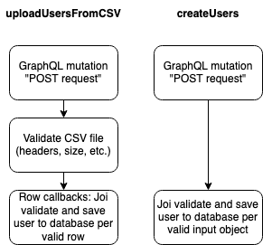

# RFC-058

## Synopsis

Make the `uploadUsersFromCSV` method more performant, which would mitigate service timeout risk.

## Background

A large (memberships in the thousands) organisation client of Kidsloop's experienced issues uploading 100 users via CSV, raised in [AD-1612](https://calmisland.atlassian.net/browse/AD-1612). The cause was documented to be a `user-service` timeout. This in turn was caused by expensive calls made to the database for certain validations, as revealed by New Relic monitoring:

1. a user's organisation memberships
2. a user's school memberships

These findings confirmed the hunches that multiple experienced team members had up until this point, that these slowdowns were caused by having to join on large data tables for large organisations.

## Potential Solutions

### Use existing root-level mutations for validation and save processes

Although CSV upload code is classified as mutation functionality, it currently lives separately from the work done to overhaul our previously-not-always-root-level mutations to being root-level mutations (with structures standardised by abstract classes). This is because it was implemented months earlier. Since `uploadUsersFromCSV` and the Create Users root-level mutation are *roughly* doing the same thing (creating users), the `uploadUsersFromCSV` method could borrow functionality from the Create Users mutation. Let's compare the processes side-by-side on a high level to observe the similarities:



We see that the only high-level difference is that `createUsers` does not validate a CSV file, because the user already supplies input objects. However, there are low-level differences in terms of input fields and validation. The table below displays what `User`-object-related input fields are validated and processed.

| Field name                | uploadUsersFromCSV| createUsers |
| ------------------------- | ----------------- | ------------|
| given name                | ✅                | ✅           |
| family name               | ✅                | ✅           |
| shortcode                 | ✅                |             |
| email                     | ✅                | ✅           |
| alternate email           |                   | ✅           |
| phone                     | ✅                | ✅           |
| alternate phone           |                   | ✅           |
| date of birth             | ✅                | ✅           |
| gender                    | ✅                | ✅           |
| organization name         | ✅                |             |
| organization role name    | ✅                |             |
| school name               | ✅                |             |
| class name                | ✅                |             |
| username                  |                   | ✅          |

Non-`User`-entity fields and validations are currently entirely missing from `createUsers`'s root-level mutation input. This could be remedied by updating the `createUsers` input and process to accommodate the validation and saving of these fields to DB. However, this would go against the intention of `createUsers` to create `User` entities with "core" fields only; client code wishing to subsequently add these users to organisations/schools/classes would use other root-level mutations after.

This leads us to the fact that we are comparing non-identical methods: `uploadUsersFromCSV` carries out multiple-entity saves to the DB under the hood (it first creates and saves `User` entities, then applies organisation memberships, etc.), in a similar way to how a client would execute changed root-level mutations like `createUsers`, then `addUsersToOrganizations`, etc. Therefore, `uploadUsersFromCSV` could be refactored to call a chain of root-level mutations: `createUsers`, then `addUsersToOrganizations`, then `addUsersToSchools`, then `addUsersToClasses`, which would mirror its current save process.

We must also consider that these root-level mutations (currently) have an input size limit of 50, or at least some hard limit which *may* be smaller than the number of users a client user wants to upload in a CSV. The users in the CSV would have to be batched and these root-level mutations called multiple times.

The above is largely concerned with *saving*, but there are also differences in validation as well:

1. Is the client user authorised to upload/create users?
2. Is the client user authorised to grant organisation/school/class memberships to users?

The `uploadUsersFromCSV` method is less stringent on permissions checking - since its validation process is tied to the organisations specified in the CSV, it only checks that the client user has upload permissions in those organisations to cover the cases where a user is added to an organisation, school, or class via `PermissionName.upload_users_40880`.

Meanwhile, the root-level mutation chain `createUsers`; `addUsersToOrganizations`; `addUsersToSchools`; `addUsersToClasses` would introduce different permission checks at each step: `createUsers`'s `PermissionName.create_users_40220` (checks if client user has this permission in *any* organisation); `PermissionName.send_invitation_40882` for organisation memberships. Permission names are unknown for `addUsersToSchools` and `addUsersToClasses` because they don't currently exist. Assuming they eventually exist, we would have to verify that these permission sets are accomplishing the same/equivalent permission checks for a client user uploading users.

The above discussion finally leads us to the question of whether DB calls would be more performant or not, when using the new root-level mutations code. Concerning how organisation memberships are loaded in the root-level mutations, the TypeORM `find` method is used:

```
const preloadedMembershipArray = OrganizationMembership.find({
    where: {
        user_id: In(args.input.map((val) => val.userIds).flat()),
        organization_id: In(args.input.map((val) => val.organizationId)),
        status: Status.ACTIVE,
    },
})
```

Here we perform a search on the organisation membership table for `user_id IN (...) AND organization_id IN (...)`, and retrieve all valid organisation memberships at once. Considering this would happen for every batch of 50 `AddUsersToOrganizations` inputs without the use of joins is already a vast improvement to the current `uploadUsersFromCSV` organisation membership validation which makes joins with the organisation membership table for every row input.

For a discussion on error handling during the described saving and validating processes, please see [Error handling](##error-handling).

### Bonus: what does the implementation code look like?

We will use the root-level mutation chain `createUsers` -> `addUsersToOrganizations` as an example of performing validation and saving on uploaded users with organisation and school entries. Currently, the validation and saving processes happen within each callback/row. We replace this with the root-level mutation chain, bearing in mind that all validation and saving processes are taken care of within each method within the chain. Instead of composing GraphQL queries to access these methods, we will use their TypeScript methods directly instead. Method signatures below:

```
createUsers(
    args: { input: CreateUserInput[] },
    context: Pick<Context, 'permissions'>
): Promise<UsersMutationResult>

addUsersToOrganizations(
    args: { input: AddUsersToOrganizationInput[] },
    context: Pick<Context, 'permissions'>
): Promise<OrganizationsMutationResult>
```

This mock implementation assumes:

* That the existing code is changed to preprocess the CSV rows (after Joi validation) as `UserCSVInput` objects held in an array in memory, for ease of presentation
* That the maximum allowed input size constraint is lifted

```
// Preprocess and Joi-validate CSV into prospective user object array
const userObjectsToUpload: UserCSVInput[] = preprocessCSV(file)

// Declare the full possible mutation chain associated with uploading users from CSV
const mutationChain = {
    createUsers: createUsers,
    addUsersToOrganizations: addUsersToOrganizations,
    addUsersToSchools: ...,
    addUsersToClasses: ...,
    anyOtherMutation: ...,
}

// Format the UserCSVInput objects to fit CreateUserInput, etc.
const createUserInputs = formatInput(userObjectsToUpload, mutationChain.createUsers)
const addUsersToOrganizationInputs = formatInput(userObjectsToUpload, mutationChain.addUsersToOrganizations)
const anyOtherEntityInputs = formatInput(userObjectsToUpload, mutationChain.anyOtherMutation)

// Commence full sweep validation of all mutation methods
// We want to fail with any validation errors before the saving process
// "True" stands for an added isDryRun parameter which ONLY validates and doesn't save
try {
    mutationChain.createUsers({createUserInputs}, userPermissions, true)
} catch (ValidationErrors) {
    const rowErrors = makeValidationErrorObjs()
    fileErrors.push(...rowErrors)
}

if (organizationsExistForUpload(userObjectsToUpload)) {
    try {
        mutationChain.addUsersToOrganizations({addUsersToOrganizationInputs}, userPermissions, true)
    } catch (ValidationErrors) {
        const rowErrors = makeValidationErrorObjs()
        fileErrors.push(...rowErrors)
    }
}

if (anyOtherEntitiesExistForUpload(userObjectsToUpload)) { ... }

if (fileErrors.length > 0) {
    return fileErrors
}

// If no fileErrors, we proceed with the saving process
try {
    mutationChain.createUsers({createUserInputs}, userPermissions, false)
    mutationChain.addUsersToOrganizations({addUsersToOrganizationInputs}, userPermissions, false)
    mutationChain.anyOtherMutation({anyOtherMutationInputs}, userPermissions, false)
} catch (AnyOtherErrors) {
    const rowErrors = makeAnyOtherErrorObjs()
    fileErrors.push(...rowErrors)
}

if (fileErrors.length > 0) {
    return fileErrors
} else {
    "CSV upload complete!" // Could be handled outside of this scope
}
```

### Refactor the existing uploadUsersFromCSV method 

The validation and save processes are currently done for every row read from the CSV in the form of callbacks. The bottleneck in performance comes from joining on large organisation and school membership tables during validation for *every* row. This is an obvious area where the same DB calls can be reduced in number to the minimum required calls. For example, for every row, the client user is checked to see if they have permission to upload users to the organisation named in the row. The number of calls from this operation alone scales to `N` CSV rows. In contrast, we can just check this permission for all *unique* organizations named in all the rows, for a total of `M` calls where `M <= N`. Both options have the same complexity O(N) of course, but unless every row contained a unique organization name, fewer DB calls would be made with the latter option which is already more performant.

Using the idea above, we can introduce the "unique validations" process which reads through the entire CSV and performs the necessary validations on entities or entity groupings. Examples of "unique" validation calls:

* Checking that the client user is a part of the organisation they're uploading users to - make one DB call per unique organisation named in the CSV
* Checking that the uploaded user's school exists in their organisation - make one DB call per unique (org -> school) mapping
* Checking that the uploaded user's class is assigned to a school in their organisation - make one DB call per unique (org -> school -> class) mapping

Two ways to refactor the current callback-per-row mechanism:

* Perform the "unique validations" process, then iterate through and save *only* the validated rows (depending on the error handling logic)
* Perform the "unique validations" process, then attach information about the valid entities and entity groupings to each callback, which iterates through all rows as normal but simply checks the validation output to determine if an error should be thrown instead of computing a validation

## Error handling

### Use existing root-level mutations for validation and save processes

The biggest difficulty is reconciling invalid input with valid input for CSVs with length greater than the maximum allowed input size constraint. Imagine the following scenario:

1. The client user uploads a CSV with 100 users
2. Given a maximum input batch size of 50, the first 50 are processed through `createUsers` and are validated and saved
3. The second batch of 50 are processed through another `createUsers` call but encounters validation errors

Currently, both `createUsers` and `uploadUsersFromCSV` reject batches which contain validation errors in them. This is all well and good if the batch was meant to be the only upload batch. But in the case of the above, one batch would be saved and the other would be rejected, which is effectively a "partial" upload and is undesirable.

A fix for this would be to make sure *all* validations are done first across all root-level mutation methods in the chain, *then* save. However, this would require changing the root-level mutations to accommodate the "dry run" option (presently availble in `uploadUsersFromCSV`) which validates the input set without executing the save process.

Another fix, arguably simpler, is to simply adjust or lift the maximum allowed input size constraint for root-level mutations in the CSV context. At time of writing, the hard ceiling for CSV maximum allowed input size is 300, so we would have to verify that root-level mutation chains taking in 300-size batches at a time would be handled well by the `user-service` app.

While this fix solves the batching issue described above, we are still left with the fact that the root-level mutation chain is modularised in such a way that `createUsers` would validate and save first, *then* `addUsersToOrganizations` validates and saves, and so on. This is prone to the same kind of issue described at the beginning of this section. Therefore we would have to return to validating *all* mutations in the chain in dry runs before saving.

### Refactor the existing uploadUsersFromCSV method

For both callback refactor options, all errors and associated rows are caught in the "unique validations" process before any callbacks or saving has been done. Error handling logic will follow exactly what is currently in place.

## Out of scope

The ideas presented in this RFC offer a potential overhaul for how all CSVs are processed, but thinking on that level is discouraged at this time because the focus is fixing [AD-1612](https://calmisland.atlassian.net/browse/AD-1612) in the short term.

## Decision

The *second* option (refactoring the existing uploadUsersFromCSV method) is chosen over the first, with the emphasis that DB calls *should be batched where possible*. The pros of the second option are:

* Requires less fundamental redesign of the existing CSV upload code - simply refactors where/when validating happens
* Less unknowns in terms of performance improvements
* Simpler and faster implement - the bug this work fixes is high priority
* Root-level mutations work is ongoing and their behaviour is subject to change

|     Reviewer     |  Status  | Color  |
|------------------|----------|-------:|
| Toghrul          | Accepted |   🟢   |
| Oliver           | Accepted |   🟢   |
| Matthew          | Pending  |   🟡   |
| Richard          | Accepted |   🟢   |
| Sam              | Pending  |   🟡   |
| Raphael          | Pending  |   🟡   |
| Marlon           | Pending  |   🟡   |
| Nicholas         | Pending  |   🟡   |